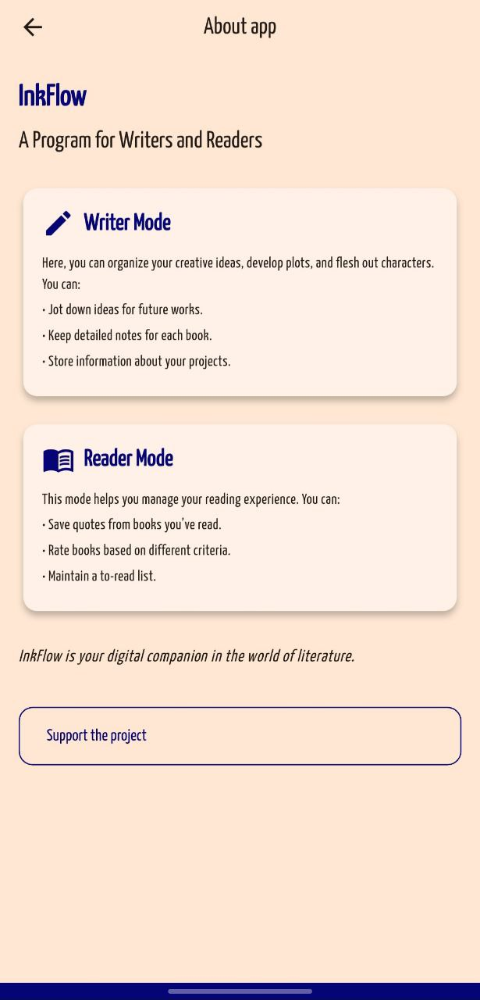
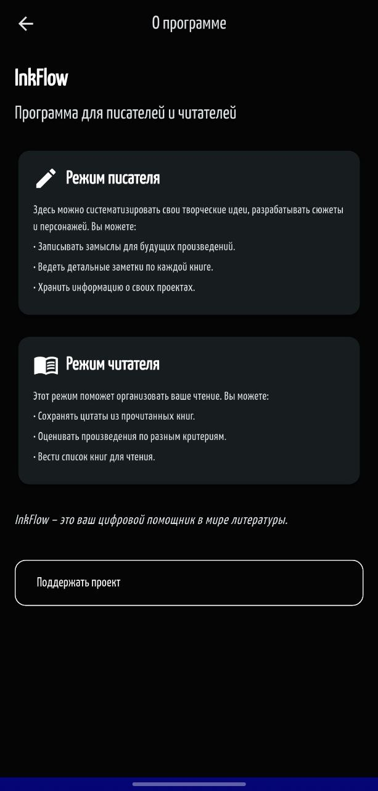

# InkFlow 📖✍️

**Кроссплатформенное приложение для писателей и читателей** с синхронизацией между устройствами и поддержкой темной темы.

## 🌟 Основные возможности

### Для писателей
- Создание и структурирование литературных проектов
- Разработка персонажей и сюжетных линий
- Система заметок для каждой книги

### Для читателей
- Учет прочитанных книг с рейтингом
- Коллекция цитат и рецензий
- Планирование списка для чтения

## 🛠 Технологический стек

| Компонент         | Описание                                                                 |
|-------------------|--------------------------------------------------------------------------|
| **Flutter**       | Кроссплатформенная разработка (iOS, Android, Web)                        |
| **Firebase**      | Аутентификация и облачное хранилище данных                               |
| **BLoC**          | Управление состоянием приложения                                         |
| **Адаптивный UI** | Поддержка темной/светлой темы и различных размеров экранов              |

## 🎨 Поддержка тем

Приложение автоматически адаптируется под системные настройки темы:
- 🌞 Светлая тема
- 🌚 Темная тема

## 📱 Скриншоты

| Светлая тема                         | Темная тема                        |
|--------------------------------------|------------------------------------|
|  |  |

## 🚀 Быстрый старт

1. Установите зависимости:
```bash
flutter pub get